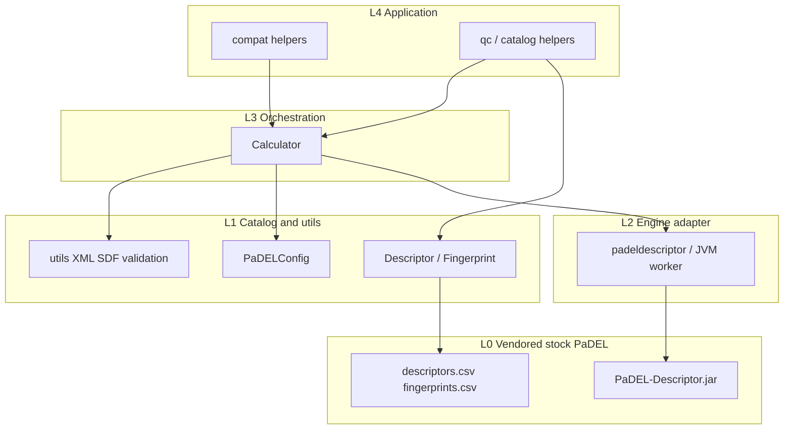

# padelpy2: Classic PaDEL fidelity and padelpy continuity for scientific Python

**Design Document — v0.3 (Approved)**

**Status:** Approved 2026-07-26. Novelty review round 3: **PROCEED**. **G0 parity complete:** PARTIAL (stock JAR ≠ ePaDEL on aromatic/2D topology for benzene; subset + MACCS exact). Path: **narrow & differentiate** (§3.2). Blueprint next.

**License:** Apache-2.0  
**PyPI / import name:** `padelpy2`  
**Upstream engine:** Stock [PaDEL-Descriptor](http://www.yapcwsoft.com/dd/padeldescriptor/) JAR (Yap, 2011), vendored under `padelpy2/PaDEL-Descriptor/`

---

## 1. Summary

`padelpy2` drives the **stock PaDEL-Descriptor Java application** from Python. It already offers an RDKit-native `Calculator` and `pandas` DataFrame results, plus a low-level `padeldescriptor` CLI mirror shared with [padelpy](https://github.com/ecrl/padelpy).

Calculator ergonomics alone are not a novelty claim. **Working uniqueness (narrow & differentiate):** (1) fidelity to the **classic Yap JAR** used by padelpy and much of the literature, (2) **padelpy continuity** (`padeldescriptor` + migration path), and (3) **regression oracles** that pin column schemas and values. G0 compared stock JAR to a peer ePaDEL bundle (PARTIAL; archive in `parity_g0/`). Public docs position padelpy vs padelpy2 only and do not name or recommend the peer package.

---

## 2. Motivation and problem statement

### 2.1 Current landscape

Molecular descriptors and fingerprints remain central to QSAR/QSPR modeling. Options in this space:

| Approach | Typical role |
|----------|----------------|
| **PaDEL-Descriptor** (Yap, 2011) | Classic Java engine; many published models use its outputs |
| **padelpy** | Thin stdlib-only CLI / dict helpers over the stock JAR |
| **padelpy2** (this package) | RDKit/`pandas` Calculator + `padeldescriptor` over the **stock JAR** |
| **Peer ePaDEL engines** (archive) | Other PaDEL-family bundles (e.g. ePaDEL); G0 compared one such peer |
| **Mordred** / **mordredcommunity** | Python-native descriptors (different engine) |
| **RDKit** / **scikit-fingerprints** | Native / sklearn-style fingerprints (not PaDEL) |
| **BlueDesc wrapper peers** | Same wrapping pattern for BlueDesc (not PaDEL) |
| **ChemDes** | Web aggregator that can invoke PaDEL |

Users who need **PaDEL-family** features in Python typically choose between **padelpy** and **padelpy2**. Clear positioning is mandatory. Historical G0 compared stock JAR to an ePaDEL peer (archive only).

### 2.2 Why now

`padelpy2` v0.1.0 already ships Calculator ergonomics but lacks fidelity oracles, mature CI, and honest related-work positioning. Round-2 novelty review showed that “RDKit + DataFrame PaDEL Calculator” is **not an empty niche**. The opportunity is a **classic-JAR fidelity and padelpy-continuity product**, not generic wrapper ergonomics alone.

### 2.3 When to use which package

| Need | Prefer |
|------|--------|
| Minimal env, SMILES/SDF → dicts, no RDKit/pandas | **padelpy** |
| Stock Yap JAR, padelpy-compatible `padeldescriptor`, RDKit → DataFrame, oracle-tested columns | **padelpy2** (this design) |
| General descriptors without PaDEL identity | **mordredcommunity** / RDKit |

**Why not merge into padelpy?** RDKit/pandas would break padelpy’s stdlib-only identity.  
**Why keep padelpy2?** G0 showed stock JAR ≢ ePaDEL on aromatic/topology for benzene. padelpy2 owns the classic-JAR + padelpy-lineage contract.  
**compat helpers:** May offer `from_smiles`-style APIs for migration from padelpy; must not be marketed as replacing padelpy.

### 2.4 Non-goals

1. Reimplement PaDEL in pure Python.
2. Compete with Mordred, mordredcommunity, RDKit, or scikit-fingerprints as a general descriptor/fingerprint calculator.
3. Claim novelty for RDKit/`pandas` Calculator UX alone without stock-JAR fidelity / padelpy continuity / oracles.
4. Multi-engine backends (Mordred/RDKit behind `Calculator`) as a headline feature.
5. Modeling / AutoML suite beyond light QC reports.
6. Breaking the existing public API of `Calculator`, preset catalogs, or default DataFrame column semantics without a major version.
7. Silently implying drop-in replacement of padelpy.

---

## 3. What's genuinely new

### 3.1 Not differentiation (parity / already elsewhere)

These are **shipped or planned as parity**, not uniqueness headlines:

- RDKit `Mol` → DataFrame Calculator and typed descriptor/fingerprint catalogs → **product features**, not uniqueness headlines by themselves
- Library-scale chunking, timeouts, NaN-aligned failures, catalog metadata/QC → **parity / UX**, not uniqueness claims
- Dual-package split with padelpy → product strategy, not scientific novelty

### 3.2 Working differentiation (narrow & differentiate)

Contingent on the engine-parity experiment (§11.3, Q0):

1. **Classic Yap JAR fidelity contract** — vendored stock `PaDEL-Descriptor.jar` (same family as padelpy); documented build/version; golden oracles for representative 2D/3D/fingerprint outputs and column schemas. Primary uniqueness claim.
2. **padelpy continuity** — low-level `padeldescriptor` CLI keyword surface; additive `compat` migration helpers; docs that map padelpy → padelpy2 without claiming to replace padelpy.
3. **Explicit two-way positioning** — Sphinx/README “when to use” among padelpy and padelpy2 (stock-JAR fidelity; peer ePaDEL comparison kept in design archive only).

### 3.3 Contingency (pivot)

If stock JAR outputs match ePaDEL within oracle tolerances for the default catalogs **and** maintainers judge CLI continuity insufficient to justify a third package, then:

- Keep **padelpy** for thin CLI
- Narrow or sunset padelpy2’s Calculator ambitions if stock-JAR differentiation collapses

---

## 4. Goals

**Novelty-earning gates:** **G0** (stock JAR vs peer ePaDEL archive) and **G2** (classic-JAR oracles). **G3** remains valuable but is **not** a uniqueness claim versus other engines.

1. **G0 — Engine parity experiment (gate). DONE 2026-07-27.** Report: [`parity_g0/PARITY.md`](parity_g0/PARITY.md). Outcome: **PARTIAL** — subset + MACCS exact; 223/2D cells differ, all on benzene (aromaticity/topology families). **§3.2 confirmed** (do not pivot). Re-run if JAR/ePaDEL bundles change.
2. **G1 — API freeze documented.** Public exports and default DataFrame shapes documented; CI guards default catalog column counts.
3. **G2 — Classic-JAR fidelity oracles (novelty gate).** Stored reference values for the stock JAR; tests fail on silent engine/wiring drift; dataset card records JAR identity and flags.
4. **G3 — Performance internals (parity / UX).** Warm-path or chunked batching with **measured** benchmarks vs padelpy. Do not market as unique invention.
5. **G4 — Test and CI maturity.** Unit/integration tests; coverage; ruff; explicit Java in CI; broader Python matrix where RDKit allows.
6. **G5 — Documentation site.** Install, quickstart, **when-to-use (padelpy vs padelpy2)**, padelpy migration, architecture, API; fix README (`Weight` not `MolecularWeight`).
7. **G6 — Additive compat and light QC.** Migration helpers and QC utilities without breaking defaults; docs discourage silent replacement narratives.
8. **G7 — Open-source readiness.** `dev`/`docs` extras; CONTRIBUTING/CHANGELOG/CITATION path for pre-release.

---

## 5. Target users and use cases

| User | Use case |
|------|----------|
| QSAR/QSPR researcher | Reproduce columns from models trained on **classic PaDEL** / padelpy CSV outputs |
| padelpy migrator | Move to RDKit + DataFrame while keeping stock-JAR semantics and CLI familiarity |
| Cheminformatics engineer | Needs `padeldescriptor`-level control plus Calculator convenience |
| Maintainer / CI author | Oracle-pinned engine behavior; clear Java/RDKit install docs |

padelpy2 does not auto-provision a JRE; document system Java requirements. Future work may add reliability UX without recommending a named third-party PaDEL wrapper.

---

## 6. Related work

| Project | What it does | Status | Overlap / gap |
|---------|--------------|--------|---------------|
| [PaDEL-Descriptor](https://pubmed.ncbi.nlm.nih.gov/21425294/) (Yap, 2011) | Classic Java engine ~1875 descriptors + fingerprints | Mature upstream | Computation; not a Python workflow |
| Peer ePaDEL wrapper (G0 archive; name omitted from public docs) | RDKit → **ePaDEL** → DataFrame (historical compare) | Historical peer | G0 PARTIAL; do not recommend or name in public docs |
| [padelpy](https://github.com/ecrl/padelpy) (PyPI ≥0.1.17) | Thin CLI / dict helpers; **stdlib-only**; stock JAR | Active (~230★) | Same JAR family; different API constraints |
| [Mordred](https://doi.org/10.1186/s13321-018-0258-y) / [mordredcommunity](https://github.com/JacksonBurns/mordred-community) | Python-native ~1800 descriptors | Community fork active | Different engine |
| [RDKit](https://www.rdkit.org/) / [scikit-fingerprints](https://github.com/scikit-fingerprints/scikit-fingerprints) | Native / sklearn fingerprints | Active | Not PaDEL |
| BlueDesc wrapper peers | Same wrapping pattern for BlueDesc | Active | Pattern peer; wrong engine |
| [ChemDes](https://doi.org/10.1186/s13321-015-0109-z) | Web multi-tool including PaDEL | Web service | Not offline stock-JAR oracles |
| ChemoPy / PyDPI / Cinfony | Older Python stacks | Historical | Not this contract |

**Build vs contribute:**

| Alternative | Contribute upstream | Build / keep padelpy2 | Assessment |
|-------------|---------------------|----------------------|------------|
| Peer ePaDEL wrapper (archive) | N/A (not named in public docs) | Stock-JAR + `padeldescriptor` + padelpy lineage | Default path: **narrow padelpy2** |
| padelpy | Would break stdlib-only | Keep separate | Still correct |
| Mordred / skfp | Wrong engine | N/A | Non-competitors for PaDEL identity |

### 6.1 Primary literature and provenance

padelpy2 **does not implement** descriptor algorithms; it drives the stock PaDEL JAR. Cite in Sphinx, docstrings, oracle cards, and any future `paper.bib`:

- Yap CW. PaDEL-Descriptor: An open source software to calculate molecular descriptors and fingerprints. *J Comput Chem.* 2011;32(7):1466-1474. doi:[10.1002/jcc.21707](https://doi.org/10.1002/jcc.21707)
- Dong J, et al. ChemDes: an integrated web-based platform for molecular descriptor and fingerprint computation. *J Cheminform.* 2015;7:60. doi:[10.1186/s13321-015-0109-z](https://doi.org/10.1186/s13321-015-0109-z)
- Moriwaki H, et al. Mordred: a molecular descriptor calculator. *J Cheminform.* 2018;10:4. doi:[10.1186/s13321-018-0258-y](https://doi.org/10.1186/s13321-018-0258-y)

Document **stock JAR** identity in public fidelity claims; keep stock-vs-ePaDEL detail in the design/parity archive only. Fingerprint family pages should cite primary sources when added to Sphinx.

---

## 7. Architecture overview

**Style:** Layered package with a functional core (catalog + XML/SDF preparation) and an imperative shell (subprocess / future worker). Dependency rule: each layer imports only from layers below; no cycles.

```
L4  Application / interop     padelpy2.compat, qc helpers (planned)
L3  Calculator orchestration  padelpy2.calculator
L2  Engine adapter            padelpy2.wrapper  (stock JAR CLI / worker)
L1  Catalog + I/O utils       padelpy2.descriptors, fingerprints, utils, config
L0  Vendored engine assets    padelpy2/PaDEL-Descriptor/ (stock JAR, CSVs, XML)
```



**Public architecture contract** is also summarized in `docs/source/architecture.rst` (keep aligned with this document).

---

## 8. Core data model and public API

### 8.1 Frozen public contract (v0.x → v1.0 unless major bump)

| Symbol | Role |
|--------|------|
| `Calculator(descriptors, config=None)` | High-level calculator |
| `Calculator.__call__(mols: list[Mol]) -> pd.DataFrame` | Compute; drop `Name` by default |
| `PaDELConfig` | Dataclass of PaDEL CLI-aligned options + `sp_timeout` |
| `descriptors`, `descriptors_2d`, `descriptors_3d` | Default descriptor catalogs |
| `fingerprints` | All fingerprint types |
| `padeldescriptor(**kwargs)` | Low-level CLI wrapper; returns output path (**padelpy continuity**) |
| `Descriptor`, `Fingerprint` | Catalog objects (submodule imports) |

**Default column counts (current shape guards; refine with G2 oracles):**

| Catalog | Columns |
|---------|---------|
| `descriptors_2d` | 1444 |
| `descriptors_3d` | 431 |
| `descriptors` | 1875 |
| Each fingerprint | `Fingerprint.n_bits` |

Excluded from default lists but importable: `AminoAcidCount`, `IPMolecularLearning`, `KierHallSmarts`.

### 8.2 Additive API sketches (planned)

```python
# padelpy2.compat — migration helpers (additive; not a padelpy replacement)
def from_smiles(
    smiles: str | list[str],
    *,
    descriptors: bool = True,
    fingerprints: bool = False,
    as_dict: bool = False,  # True ≈ padelpy mapping return
    config: PaDELConfig | None = None,
) -> pd.DataFrame | dict | list[dict]:
    ...

def from_sdf(path: PathLike, *, as_dict: bool = False, ...) -> pd.DataFrame | list[dict]:
    ...

def from_mdl(path: PathLike, *, as_dict: bool = False, ...) -> pd.DataFrame | list[dict]:
    ...
```

```python
# Optional Calculator kwargs (defaults preserve current behavior)
results = calc(
    mols,
    retain_names: bool = False,
    on_error: Literal["raise", "nan"] = "raise",
    chunk_size: int | None = None,
)
```

```python
# Light QC (parity UX only)
@dataclass(frozen=True)
class DescriptorQCReport:
    n_rows: int
    n_cols: int
    nan_fraction: dict[str, float]
    constant_columns: tuple[str, ...]
    non_finite_columns: tuple[str, ...]

def summarize_descriptor_frame(df: pd.DataFrame) -> DescriptorQCReport:
    ...
```

### 8.3 Validation rules

- Reject invalid RDKit molecules before invoking Java when possible.
- Enforce existing atom-count and 3D-conformer checks when 3D descriptors are selected.
- Require a discoverable `java` executable; raise a clear error with install guidance.
- Do not silently change default descriptor XML selection or default DataFrame columns.
- Document that the engine is the **stock JAR**, not ePaDEL.

---

## 9. Module design

### 9.1 `padelpy2.descriptors` / `padelpy2.fingerprints` (L1)

**Purpose:** Typed catalogs backed by vendored CSVs (API parity with peers; not a uniqueness claim).  
**Key types:** `Descriptor`, `Fingerprint`; module-level singletons; preset lists.

### 9.2 `padelpy2.config` (L1)

**Purpose:** `PaDELConfig` mirroring PaDEL CLI flags + subprocess timeout (supports padelpy-like control).

### 9.3 `padelpy2.utils` (L1)

**Purpose:** XML generation, temp SDF/XML I/O, molecule validation, subprocess helpers.  
**Planned:** Argument-list `Popen`; shared helpers for worker and CLI paths.

### 9.4 `padelpy2.wrapper` (L2)

**Purpose:** `padeldescriptor` — stock JAR CLI; padelpy continuity surface.  
**Planned:** Internal reuse/chunking as UX parity; signature stays keyword-compatible.

### 9.5 `padelpy2.calculator` (L3)

**Purpose:** Catalog → XML → SDF → stock JAR → DataFrame.

### 9.6 `padelpy2.compat` (L4, planned)

**Purpose:** padelpy migration helpers.  
**Non-goal:** Replacing padelpy; auto-JRE provisioning is out of scope unless added later as padelpy2 work.

### 9.7 `padelpy2.qc` (L4, planned)

**Purpose:** Light DataFrame QC / catalog introspection (parity UX only).

### 9.8 Vendored `PaDEL-Descriptor/` (L0)

**Purpose:** Ship **stock** JAR, native libs, metadata CSVs.  
**Contract:** Document JAR identity vs ePaDEL; version schema with oracles.

---

## 10. Dependencies and ecosystem integration

| Dependency | Role | Notes |
|------------|------|-------|
| **Java JRE 8+** (system) | Runtime for stock PaDEL | Documented; CI installs Temurin (no auto-JRE claim) |
| **pandas** | DataFrame results | Hard dependency |
| **RDKit** | `Mol` I/O for Calculator | Conda-first; optional `[rdkit]` extra where wheels exist |
| **pytest / ruff / coverage** | Dev quality | `[dev]` extra |
| **Sphinx** | Docs | `[docs]` extra; GitHub Pages today |

Interoperability claim: for the same structures and flags, outputs match the **bundled stock JAR** CSV. Do not claim identity with ePaDEL without G0 evidence.

---

## 11. Validation strategy

### 11.1 Unit tests

- XML generation and descriptor-type counting
- Invalid mol / atom limit / missing 3D conformer
- `PaDELConfig` field forwarding (mocked subprocess)
- Missing Java error path
- Catalog metadata (`n_bits`, descriptions)

**Coverage target:** aim ≥95% line coverage on Python package modules excluding vendored assets; CI fail-under **90%**.

### 11.2 Integration tests

- Default catalog shape guards (1444 / 431 / 1875 / fingerprint bits)
- Custom subsets and mixed descriptor + fingerprint calculators
- End-to-end golden value comparisons for a small SMILES set (G2)

### 11.3 Regression / fidelity fixtures and G0 parity

- **G0:** Historical parity report vs a peer ePaDEL bundle on a fixed SMILES list (`parity_g0/`); regeneration script removed so the repo does not name the peer package.
- **G2:** Store stock-JAR reference CSVs under `tests/fixtures/` or `data/oracles_v1/` with dataset card (JAR hash/version, flags, SMILES, license, limitations).
- Float comparisons use documented tolerances.
- Cite Yap (2011) for engine identity; fixtures are package-generated unless a literature table is separately cited.

### 11.4 Benchmarks

- Cold vs warm / chunked paths; 10 / 100 / 1000 molecules
- Compare to **padelpy** for migration messaging
- Do not claim unique speed leadership without numbers
- Do **not** claim superiority over Mordred/skfp for general descriptors

### 11.5 Notebooks

- Refresh `examples/example.ipynb`: install → MWE → one result → custom subset
- Optional verification notebook with pass criteria tied to G2 oracles

### 11.6 CI gates

- Explicit Java setup
- `ruff` + `pytest` (+ coverage threshold)
- Sphinx `-W` when docs mature
- Matrix: RDKit-supported Python versions within `requires-python`

---

## 12. Open-source packaging

| Concern | Decision |
|---------|----------|
| Build backend | setuptools (current) |
| Layout | Flat `padelpy2/` until packaging friction warrants `src/` |
| Python versions | 3.9–3.13 per `pyproject.toml` (document supported range; do not over-claim) |
| License | Apache-2.0; respect PaDEL/third-party notices in bundle |
| Docs | Sphinx; padelpy vs padelpy2 positioning; GitHub Pages and/or RTD |
| CI | Lint + test + Java; release on tag |
| Release | Semver; additive minor; breaks major |
| Governance | CONTRIBUTING, CHANGELOG, SECURITY, CITATION.cff before broader push |
| Citation | Yap (2011) for PaDEL; CITATION.cff for padelpy2 |

---

## 13. Roadmap

| Version | Scope |
|---------|-------|
| **0.1.x (current)** | Calculator + catalogs + wrapper; shape tests; thin docs |
| **0.2** | Design approved; **G0 parity report**; CI/Java/coverage/ruff; unit tests; Sphinx install/quickstart/**when-to-use (padelpy vs padelpy2)**; README fixes; **G2 stock-JAR oracles v1** |
| **0.3** | G3 warm-path/chunking as UX parity; measured benchmarks vs padelpy (± peer); optional Calculator kwargs |
| **0.4** | `compat` + padelpy migration guide; light QC; tutorial path |
| **1.0** | API freeze; governance; pre-release; JOSS only if §3.2 still holds after G0/G2 evidence |
| **Pivot branch** | If G0 negates stock-JAR gap: narrow padelpy2 scope; keep padelpy for thin CLI |

---

## 14. Open questions

| # | Question | Options | Recommendation | Owner |
|---|----------|---------|----------------|-------|
| **Q0** | Stock JAR vs ePaDEL output parity | Match / partial / material | **Resolved: PARTIAL** (benzene aromatic/topology diffs). See `parity_g0/PARITY.md` | Maintainer |
| Q1 | Path after G0 | Narrow §3.2 vs pivot | **Resolved: proceed §3.2** (narrow & differentiate) | Maintainer |
| Q2 | JVM reuse mechanism | Keep-alive vs multi-process chunks vs defer to peer | Implement only as UX parity after G0; measure (G3) | Maintainer |
| Q3 | RDKit dependency policy | Hard dep vs extras-only | Calculator requires RDKit; conda-first; relax pip pin when tested | Maintainer |
| Q4 | `as_dict=True` compat fidelity | Best-effort vs strict padelpy tests | Best-effort + documented differences | Maintainer |
| Q5 | JOSS | Yes / no | Only if classic-JAR fidelity + padelpy continuity remain the Statement of need after G0/G2 | Maintainer |
| Q6 | Architecture verification | Align `architecture.rst` now vs later | Align with §7 now; refine after engine-adapter work | Maintainer |

---

## 15. Novelty review record

### Round 1 — 2026-07-26

| Field | Value |
|-------|-------|
| Verdict | **REVISE** → incorporated in v0.2 |
| Focus | Dual-package vs padelpy; Mordred/BlueDesc framing; shipped vs planned |

### Round 2 — 2026-07-26

| Field | Value |
|-------|-------|
| Verdict | **REVISE** → incorporated in **v0.3** (this document) |
| Missed peer (corrected; name omitted publicly) | Peer ePaDEL wrapper used only for G0 archive |
| Retracted claim | “No mature package owns PaDEL + RDKit/pandas Calculator” |
| Working path | **Narrow & differentiate**: stock JAR + padelpy continuity + oracles |
| Contingency | **Pivot** if G0 shows no material engine gap |

### Round 3 — 2026-07-26

| Field | Value |
|-------|-------|
| Verdict | **PROCEED** (conditional on G0) |
| G0 outcome (2026-07-27) | **PARTIAL** — §3.2 confirmed |
| Next workflow | `python-package-blueprint` → `execute-blueprint-task` |

---

## Appendix A — API stability checklist

Do **not** change without a major version:

- [ ] Signatures of `Calculator.__init__`, `Calculator.__call__` (required args)
- [ ] Default contents of `descriptors` / `descriptors_2d` / `descriptors_3d` / `fingerprints`
- [ ] Default dropping of the `Name` column
- [ ] `padeldescriptor` keyword names used by existing callers
- [ ] Default `PaDELConfig` field values

Additive changes are encouraged when defaults preserve the above.

## Appendix B — Provenance notes

- Engine: **stock** PaDEL-Descriptor JAR (Yap, 2011); bundled under `padelpy2/PaDEL-Descriptor/`.
- Peer engine: **ePaDEL** bundle — G0 archive only; do not equate without evidence.
- Spiritual predecessor: [padelpy](https://github.com/ecrl/padelpy); when-to-use in §2.3.
- Descriptor/fingerprint metadata: vendored CSV tables.
- Pattern peers: other PaDEL-family wrappers (same problem space historically), BlueDesc wrappers (pattern only).
